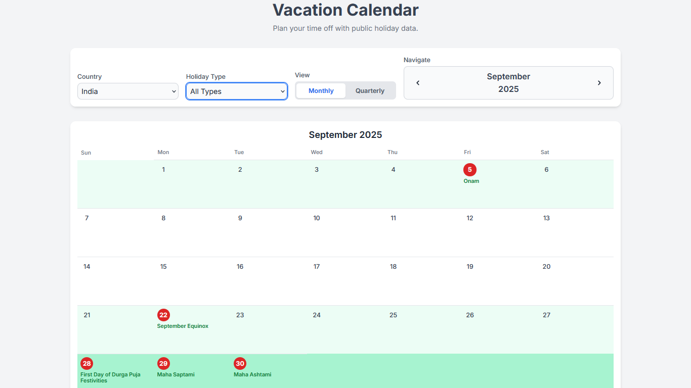
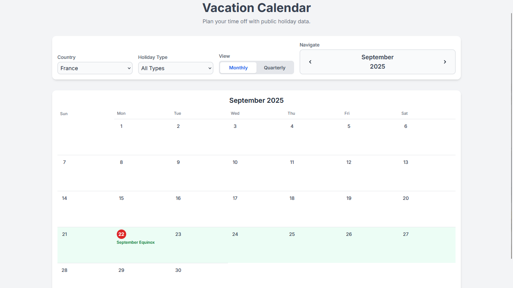
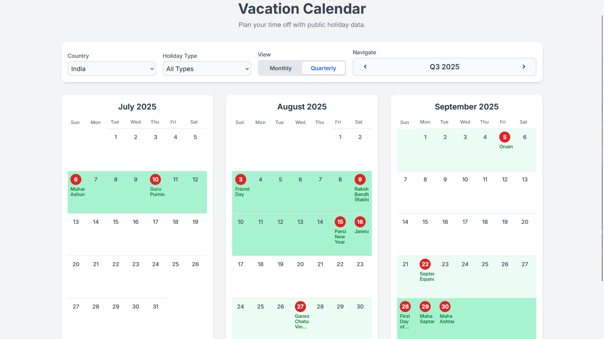

# Vacation Calendar 🗓️

A dynamic, full-stack web application that fetches and displays public holidays from around the world, helping you plan your vacations and time off with ease. Built with a robust Spring Boot backend and a clean, responsive frontend.




---

## ✨ Key Features

* **🌍 Global Holiday Data:** Select any country from a dynamically populated list to view its specific public holidays.
* **🎨 Dynamic Weekly Highlighting:**
    * Weeks with a **single holiday** are highlighted in light green.
    * Weeks with **multiple holidays** are highlighted in a darker green for easy identification.
* **VIEW_MODES ↔️ Multiple Calendar Views:**
    * **Monthly View:** A detailed look at one month at a time.
    * **Quarterly View:** A broader, three-month overview for long-term planning.
* **FILTERING 🏷️ Holiday Type Filtering:** Filter holidays by type, including National, Local, Religious, and more.
* **🔐 Secure API Handling:** The external API key is securely managed on the backend and is never exposed to the client-side.
* **📱 Fully Responsive:** A clean, modern UI that works beautifully on desktop, tablets, and mobile devices.

---

## 📸 Screenshots

### Monthly View
The detailed monthly view clearly shows holiday names and highlights weeks with one or more holidays.
**

### Quarterly View
The quarterly view provides a high-level overview, perfect for planning further ahead.
**

---

## 🛠️ Tech Stack

This project is built with a modern, industry-standard technology stack.

* **Backend:**
    * **Java 17**
    * **Spring Boot 3** (for creating the REST API)
    * **Maven** (for dependency management)
* **Frontend:**
    * **HTML5**
    * **CSS3** (with **Tailwind CSS** for rapid UI development)
    * **JavaScript (ES6+)** (for frontend logic and API communication)
* **API:**
    * [**Calendarific API**](https://calendarific.com/) for global holiday data.

---

## 🚀 Getting Started

Follow these instructions to get a copy of the project up and running on your local machine for development and testing purposes.

### Prerequisites

* **Java Development Kit (JDK) 17 or later**
* **Apache Maven**
* A free API key from [Calendarific](https://calendarific.com/signup)

### Installation & Setup

1.  **Clone the repository:**
    ```sh
    git clone [https://github.com/mo-sahil/vacation-calendar.git](https://github.com/mo-sahil/vacation-calendar.git)
    cd vacation-calendar
    ```

2.  **Configure the API Key:**
    * Navigate to `src/main/resources/application.properties`.
    * Find the line `calendarific.api.key=YOUR_CALENDARIFIC_API_KEY`.
    * Replace `YOUR_CALENDARIFIC_API_KEY` with your actual key from Calendarific.

    ```properties
    # src/main/resources/application.properties

    # Calendarific API Configuration
    # IMPORTANT: Replace YOUR_CALENDARIFIC_API_KEY with your actual key
    calendarific.api.key=a1b2c3d4e5f6a1b2c3d4e5f6...
    ```

3.  **Build and run the application:**
    * Use the Maven wrapper to start the Spring Boot application.
    ```sh
    mvn spring-boot:run
    ```

4.  **Open the application:**
    * Once the application has started, open your web browser and navigate to:
    * `http://localhost:8080`

You should now see the Vacation Calendar running in your browser!
